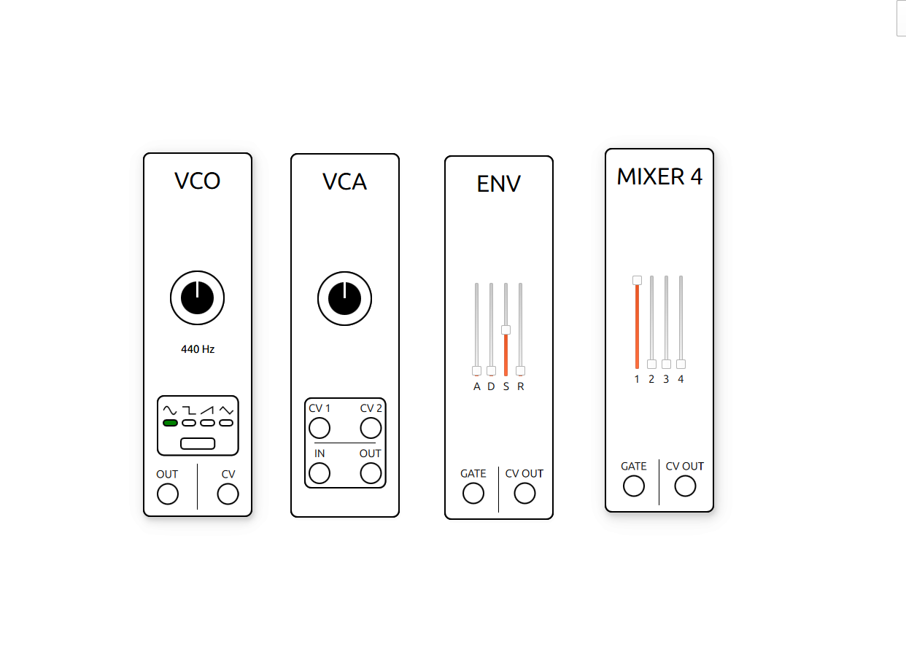

# 🎛️ Modular Digital Synthesizer

## Cross-platform modular digital synthesizer — PC & Embedded (Work in progress)

### Overview

A C++ modular synthesizer engine designed to run both on desktop (PC) and embedded hardware (Daisy Seed / STM32). The project aims to digitally replicate the behavior of classic analog modular synthesizer modules, with a focus on real-time audio processing and object-oriented programming.

### Architecture

The project is separated in three parts :

- A real-time cross-platform DSP library. It emulates physical modules : Voltage Controlled Oscillator (VCO), Voltage Controlled Amplificator (VCA), etc.
- A PC layer that uses the DSP library and implements a full modular synthesizer (work in progress), featuring a graphical interface made with the Qt framework and a pure C++ backend.
- An embedded layer (to come).

### DSP Library

All modules share a base class (AudioModule), that share a few attributes : the totalSamplesElapsed, with is used to calculate what should happen relatively to the audio frame rate (44000 samples / second), a name, and a render function.

## Modules

🔊 OSC — Digital Oscillator
Generates an digital audio signal : Sine, square and saw waves.

🔊 VCA — Voltage Controlled Amplifier

Controls the amplitude of an audio signal using a CV input (0–10V standard).

```cpp
audioOutput = audioInput * (gain * (CV_in / 10.0f));
```

- `CV_in` ranges from 0V to 10V
- Divided by 10 to obtain a normalized gain (0.0 → 1.0)
- Multiplied by a manual `gain` parameter (default: 1.0)

📈 Envelope — ADSR
Generates a control voltage envelope following the classic Attack / Decay / Sustain / Release shape.
All envelope outputs are in the 0V → 10V range to match the CV standard.

📈 CV Standard
The project follows the 0–10V CV standard, common in Eurorack modular synthesis

## Usage

Include the dsp library :

```cpp
    #include <dsp/dsp.hpp>
```

Instantiate a module of your choice :

```cpp
Vco vco;
```

Then on every audio frame, call its render function :

```cpp
vco.render()
```

And the module will output its current value for this sample (e.g., vco.audioOutput\_). Send that sample to your buffer (soundcard for PC, DAC for embedded), and you will be on your way to hear something.
Since the library is built to be cross-platform, you either need to patch and connect the modules outputs and inputs together using either software or physical cables.

### PC Implementation (work in progress)

The implementation runs on a multithreaded architecture:

- An audio thread run by RtAudio that renders real-time audio
- An UI thread that handles input parameters and memory allocation

The UI is made with Qt Framework and is currently in progress. Here's a preview of what it looks right now :


## Usage

It is made around a Synth class that contains all AudioModules.

Instantiate a Synth class :

```cpp
    Synth synth;
```

Then, some audio modules :

```cpp
    synth.addAudioModule(OSC);
    synth.addAudioModule(VCA);
    synth.addAudioModule(MIXER_4);
```

Get their outputs in some ways (its still in progress) and connect them :

```cpp
    synth.connect(vcoptr->audioOutput, vcaptr->audioInput);
    synth.connect(vco2ptr->audioOutput, vcaptr->audioInput);
    synth.connect(vcaptr->audioOutput, mixerptr->audioInputs[0]);
    synth.connect(envptr->cvOut, vcaptr->CV_in);
```

## Roadmap

Qt graphical interface and PC Build
VCF — Voltage Controlled Filter
Conception and implementation of physical embedded mdules

Author
lekix-lekix — github.com/lekix-lekix

```

```
